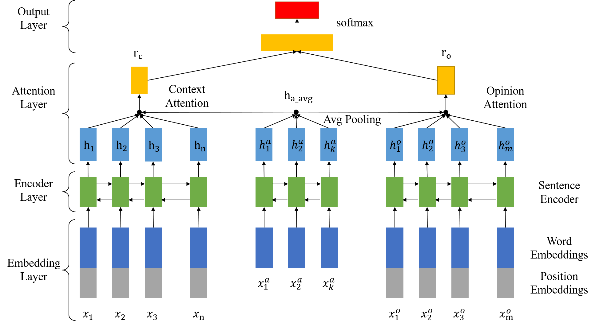

# Position-Aware Hybrid Attention Network for Aspect-Level Sentiment Analysis

Code for Paper "Position-Aware Hybrid Attention Network for Aspect-Level Sentiment Analysis"

 *CCIR*, 2020

## **Model**


## **Requirements**
- python==3.7
- tensorflow-gpu=1.13.1
- cuda=10.2
- scikit-learn
- matplotlib

## **Training**
```
python main.py
```

## **Evaluate**
```
python infer.py
```

## **Citation**
```bibtex
@inproceedings{zheng2020position,
    title = {Position-aware Hybrid Attention Network for Aspect-Level Sentiment Analysis},
    author = {Zheng, Yongqiang and Li, Xia and Su, Guixin and Ma, Junteng and Ning, Chaolin},
    booktitle = {Information Retrieval: 26th China Conference, CCIR 2020, Xi'an, China, August 14--16, 2020, Proceedings 26},
    series = {Lecture Notes in Computer Science},
    volume = {12285},
    pages = {83--95},
    year = {2020},
    doi = {10.1007/978-3-030-56725-5_7},
    url = {https://doi.org/10.1007/978-3-030-56725-5_7},
}
```
